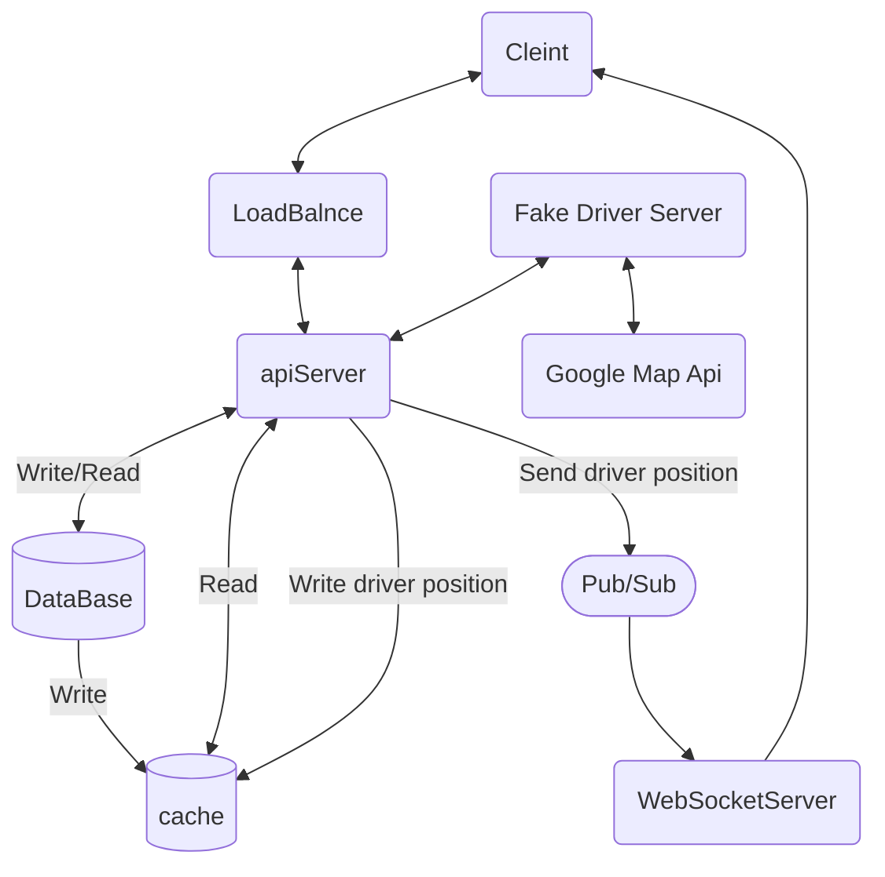
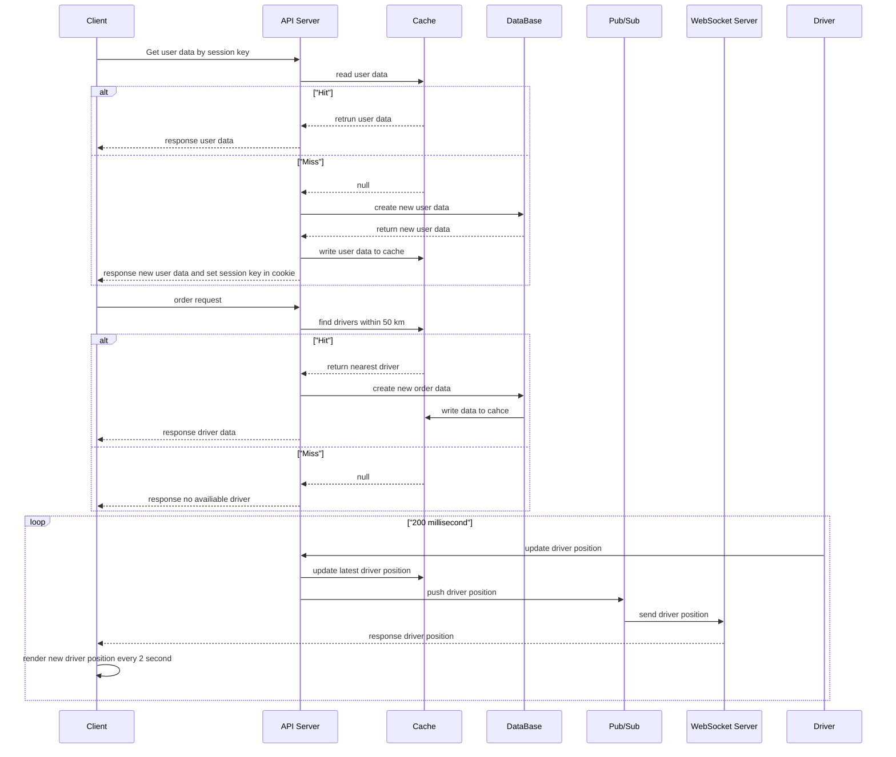

# Welcome to Call Taxi Project
[English](README.md) | [日本語](ja_README.md)

## Feature
- Track the driver’s location
- Show estimated arrival time and distance
- Show Driver Path

## Flowchart

## Sequence Diagram

## Instructions

### 1.Select departure location.

### 2.Select destination location.

### 3.Click call texi button.

### 4.The driver status will  show pick up.

### 5.The map will follow the driver’s location and show the route.

### 6.When the driver arrives at the departure location, the driver status will be "send".

### 7.When the driver arrives at the destination location, the order status will be "complete".

### 8.Click cancel button,the order status will be "cancel".

### Notice 
#### 1.The session key will be stored in a cookie for one hour. If you are inactive for one hour, the cookie will expire. If you click the “Call Taxi” button, a “Server busy” alert will be displayed. Please refresh the page.

#### 2.Click “Unfollow Driver” to stop following the driver on the map, while the route will remain displayed.

## Soruce code
[Frontend](https://github.com/Neelein/call_taxi_front_end) |
[Fake driver server](https://github.com/Neelein/call_taxi_fake_driver) |
[WebSocket server](https://github.com/Neelein/call_taxi_websocket) |
