# Call Taxi プロジェクト
[English](README.md) | [日本語](ja_README.md)

## 機能
- ドライバーの位置を追跡する
- 到着予想時間と距離を表示する
- ドライバーの走行経路を表示する

## フローチャート
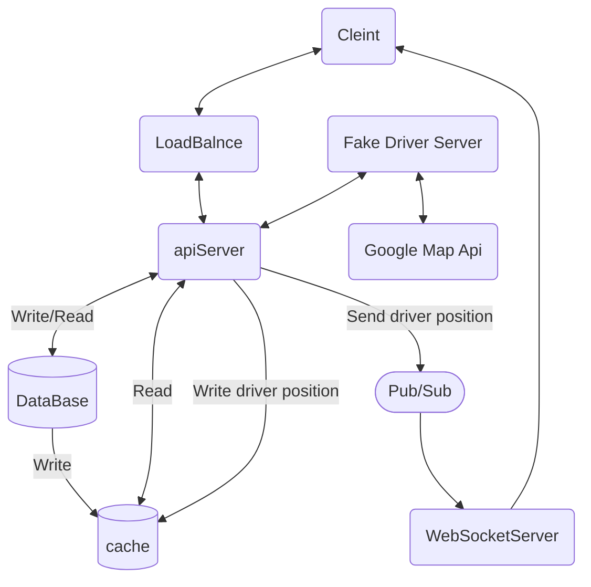

## シーケンス図

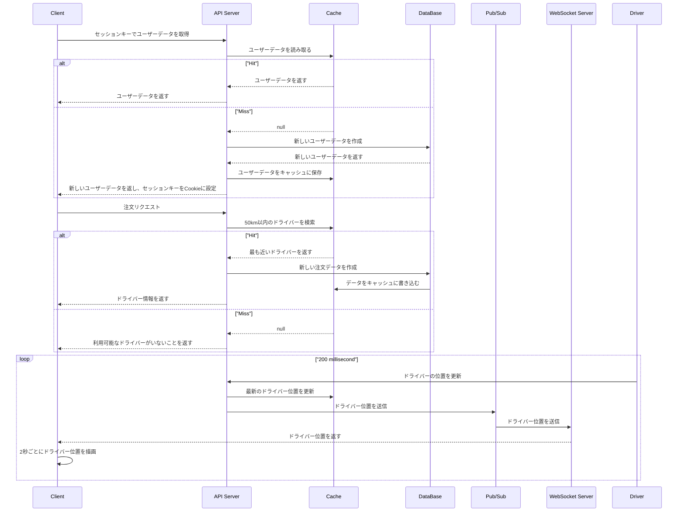

## 説明

### 1. 出発地点を選択する。
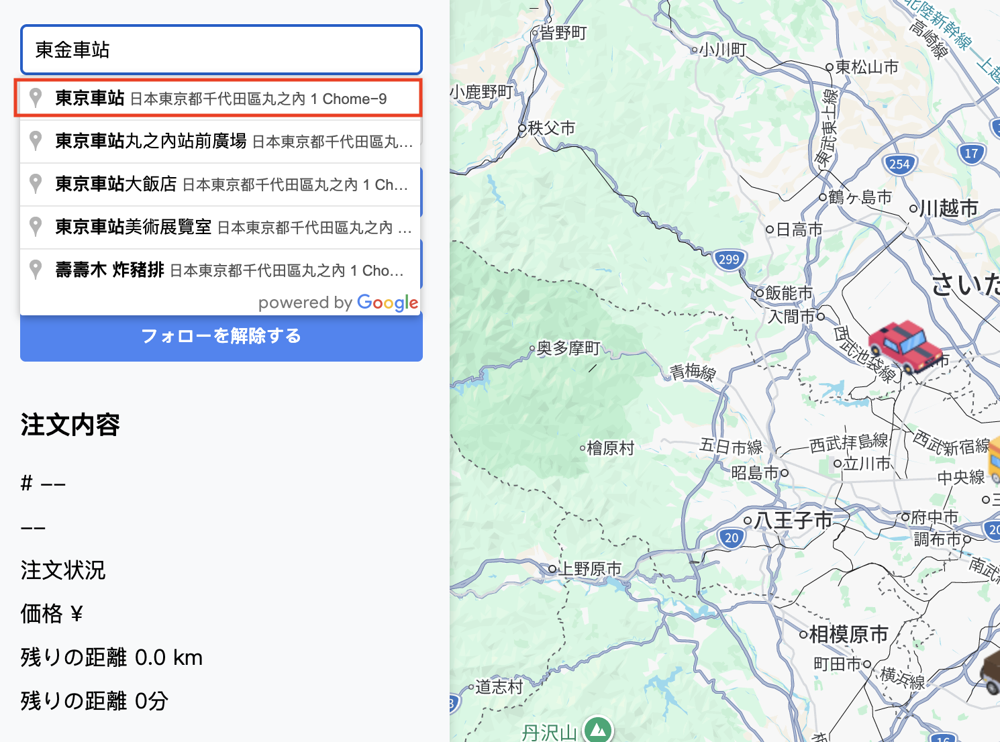
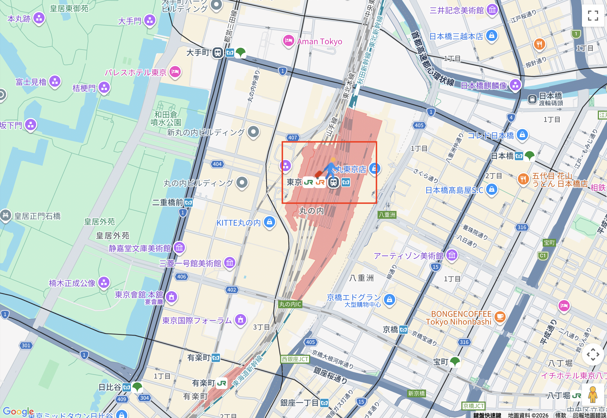

### 2. 目的地を選択する。
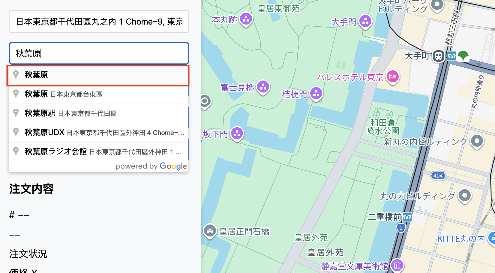
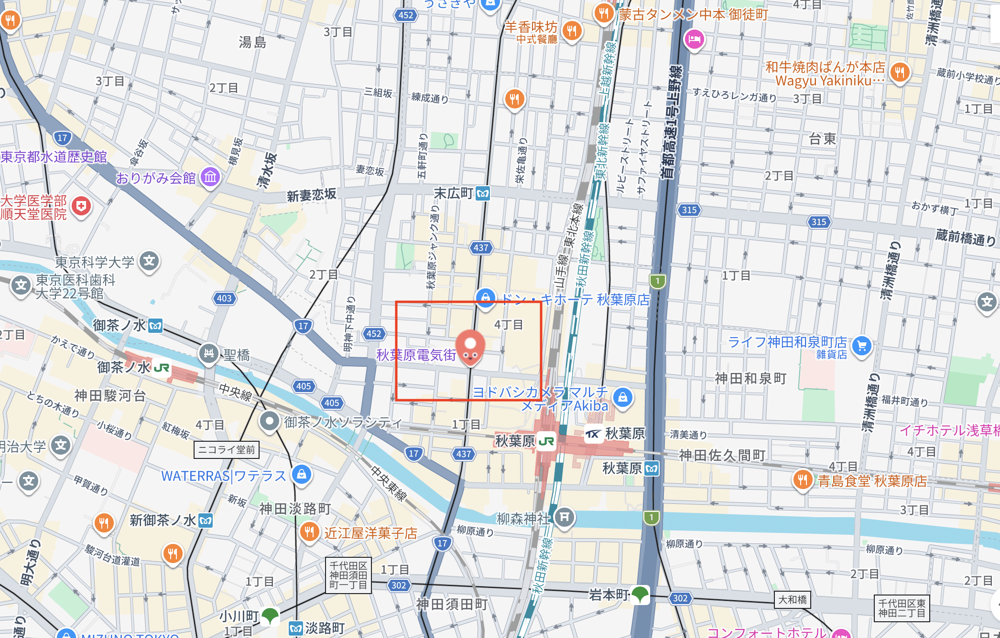

### 3. 「タクシーを呼ぶ」ボタンをクリックする。
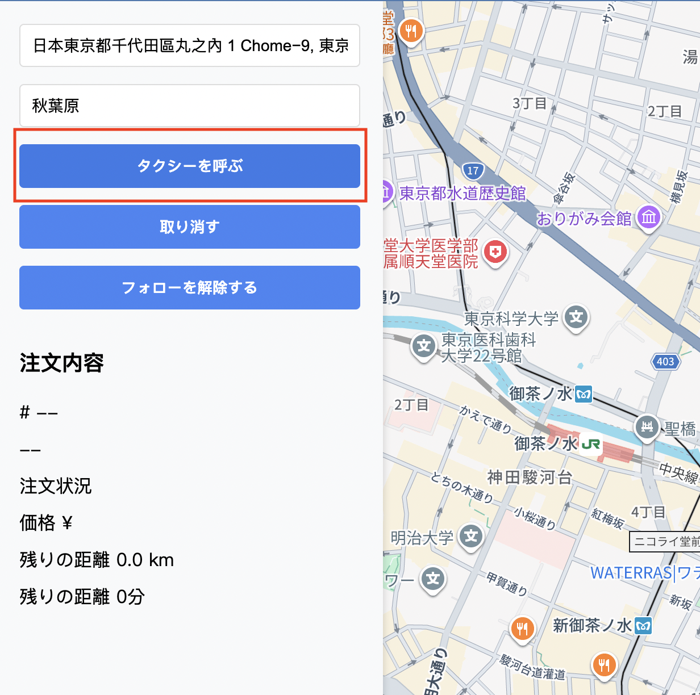

### 4. ドライバーのステータスは「pick up」と表示される。

### 5. 地図はドライバーの位置に追従し、ルートを表示する。
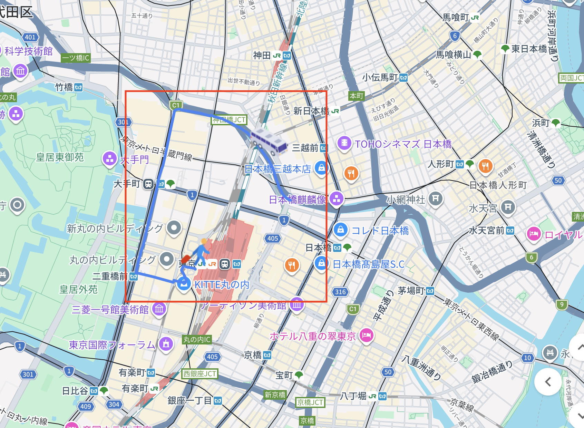

### 6. ドライバーが出発地点に到着すると、ドライバーのステータスが送信される。
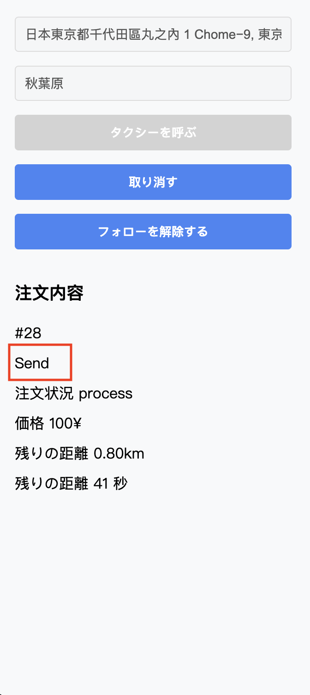

### 7. ドライバーが目的地に到着すると、注文ステータスは「complete」になる。
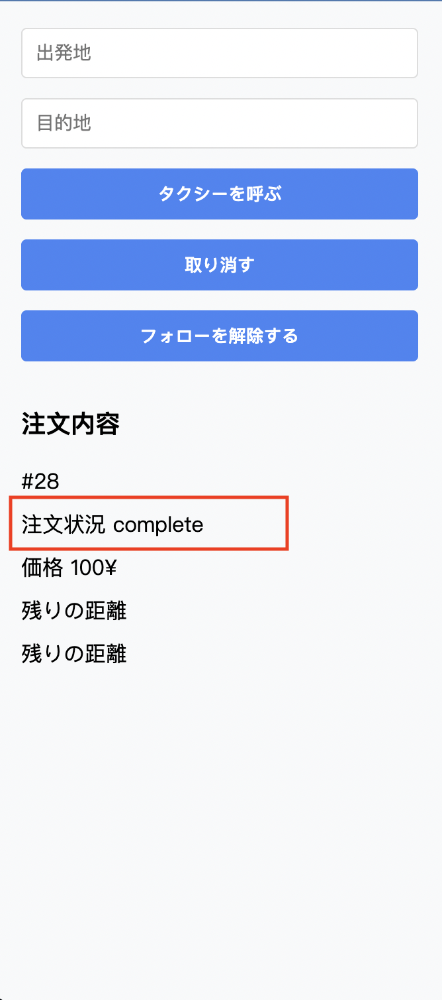

### 8. 「取り消す」ボタンをクリックすると、注文ステータスは「cancel」になる。
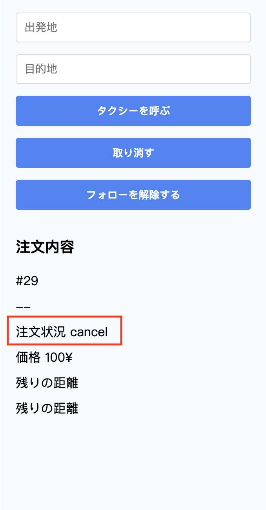

## 注意事項 

### 1.セッションキーはCookieに1時間保存される。1時間何も操作しない場合、Cookieは消える。「タクシーを呼ぶ」ボタンをクリックすると、「Server busy」というアラートが表示される。ページを更新してください。
### 2.「フォローを解除する」をクリックすると、地図はドライバーの追跡を解除するが、ルートは表示され続ける。

## Soruce code
[Frontend](https://github.com/Neelein/call_taxi_front_end) |
[Fake driver server](https://github.com/Neelein/call_taxi_fake_driver) |
[WebSocket server](https://github.com/Neelein/call_taxi_websocket) |
